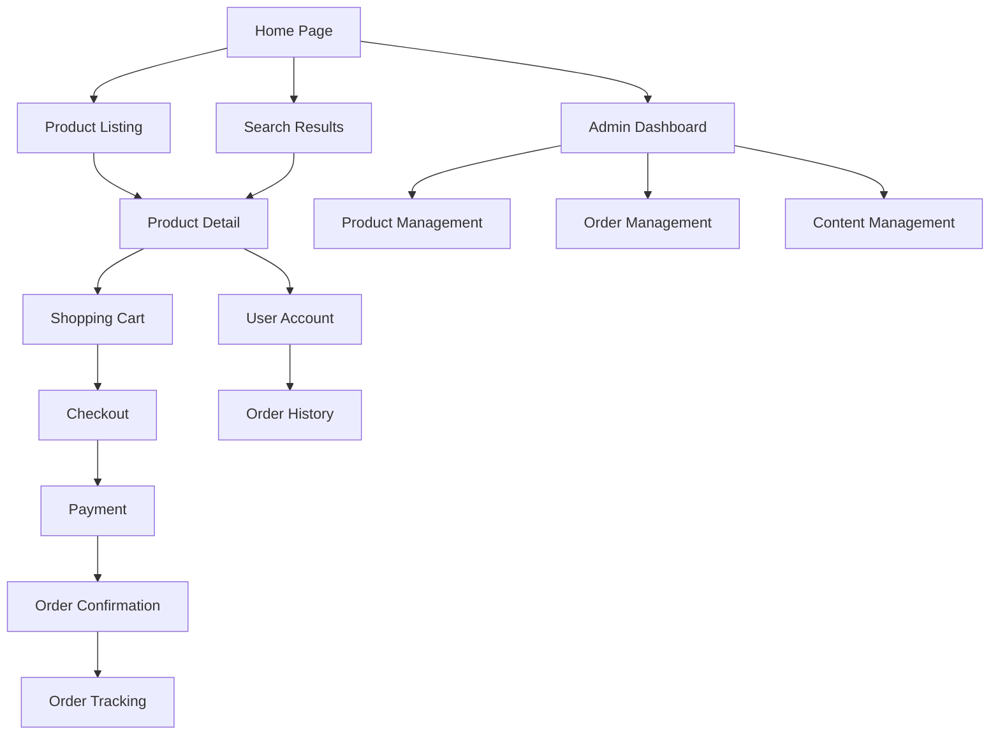

## 1. Product Overview
A comprehensive e-commerce platform for fashion products featuring advanced product catalog management, secure payment processing, and high-performance user experience. The platform serves fashion retailers and consumers with seamless shopping experience, multiple payment options, and robust content management capabilities.

Target market: Fashion retailers and online clothing stores seeking a modern, scalable e-commerce solution with Vietnamese payment integration support.

## 2. Core Features

### 2.1 User Roles
| Role | Registration Method | Core Permissions |
|------|---------------------|------------------|
| Customer | Email, Google, Facebook OAuth | Browse products, add to cart, place orders, track orders, manage profile |
| Admin | Admin panel registration | Manage products, orders, users, content, banners, blogs, system settings |
| Guest | No registration required | Browse products, add to cart, checkout as guest |

### 2.2 Feature Module
Our e-commerce platform consists of the following main pages:
1. **Home page**: Hero banner, featured products, category navigation, promotional sections
2. **Product listing page**: Product grid, filters (size, color, price), sorting, pagination
3. **Product detail page**: Product images gallery, variant selection, size guide, reviews, related products
4. **Shopping cart page**: Cart items management, quantity adjustment, price calculation
5. **Checkout page**: Shipping address, payment method selection, order summary
6. **Order tracking page**: Order status, shipping information, order history
7. **User account page**: Profile management, order history, address book, wishlist
8. **Admin dashboard**: Product management, order management, content management, analytics
9. **Blog page**: Fashion articles, style guides, trend updates
10. **Search results page**: Product search, filtering, search suggestions

### 2.3 Page Details
| Page Name | Module Name | Feature description |
|-----------|-------------|---------------------|
| Home page | Hero banner | Display promotional banners with auto-rotation, click-through to product pages |
| Home page | Featured products | Show trending/new products with quick view option, add to cart functionality |
| Home page | Category navigation | Organized fashion categories with subcategory dropdown menus |
| Product listing | Product grid | Display products in responsive grid layout with lazy loading, WebP images |
| Product listing | Filters sidebar | Filter by size, color, price range, brand, availability with real-time updates |
| Product listing | Sorting options | Sort by price, popularity, newest, customer ratings |
| Product detail | Image gallery | Multiple product images with zoom functionality, WebP format support |
| Product detail | Variant selector | Size and color selection with stock availability display |
| Product detail | Size guide | Interactive size chart with measurement instructions |
| Product detail | Customer reviews | Display ratings, reviews, photo reviews with helpful vote system |
| Shopping cart | Cart items list | Show product details, quantity controls, remove items, price calculations |
| Shopping cart | Cart summary | Display subtotal, shipping cost, estimated tax, total amount |
| Checkout | Shipping address | Add/edit shipping addresses, save for future use |
| Checkout | Payment methods | VNPay, MoMo, Credit Card, COD options with secure processing |
| Checkout | Order summary | Final order review with itemized costs before payment |
| Order tracking | Order status | Real-time order status updates, shipping tracking information |
| Order tracking | Order history | View all past orders, reorder functionality, download invoices |
| User account | Profile management | Update personal information, change password, manage preferences |
| User account | Address book | Save multiple shipping addresses, set default address |
| User account | Wishlist | Save favorite products, share wishlist, price drop notifications |
| Admin dashboard | Product management | CRUD operations for products, variants, inventory management |
| Admin dashboard | Order management | View/process orders, update status, generate shipping labels |
| Admin dashboard | Content management | Create/edit banners, blog posts, SEO metadata |
| Admin dashboard | Analytics dashboard | Sales reports, customer insights, inventory reports |
| Blog | Article listing | Display blog posts with categories, tags, search functionality |
| Blog | Article detail | Full article content, related articles, social sharing |
| Search results | Search functionality | Real-time search suggestions, typo tolerance, search history |
| Search results | Results filtering | Filter search results by same criteria as product listing |

## 3. Core Process
**Customer Flow:**
1. Browse homepage and discover products through various sections
2. Navigate to product categories or use search functionality
3. Apply filters to narrow down product selection
4. View product details, select variants, check availability
5. Add products to shopping cart
6. Proceed to checkout, enter shipping information
7. Select payment method and complete payment
8. Receive order confirmation and tracking information
9. Track order status and delivery progress

**Admin Flow:**
1. Login to admin dashboard with secure credentials
2. Manage product catalog including variants and inventory
3. Process incoming orders and update order status
4. Create promotional banners and blog content
5. Monitor sales performance and customer analytics
6. Manage customer accounts and support requests



## 4. User Interface Design

### 4.1 Design Style
- **Primary Colors**: Deep navy blue (#1a2332) for headers, white (#ffffff) for backgrounds
- **Secondary Colors**: Soft gray (#f8f9fa) for sections, accent coral (#ff6b6b) for CTAs
- **Button Style**: Rounded corners (8px radius), subtle shadows, hover effects
- **Typography**: Modern sans-serif (Inter), 16px base size, responsive scaling
- **Layout**: Card-based design with generous whitespace, mobile-first responsive grid
- **Icons**: Minimalist line icons, consistent stroke width, SVG format

### 4.2 Page Design Overview
| Page Name | Module Name | UI Elements |
|-----------|-------------|-------------|
| Home page | Hero banner | Full-width carousel with fade transitions, overlay text, responsive breakpoints |
| Product listing | Product cards | Hover zoom effects, quick-view modal, WebP images with fallbacks |
| Product detail | Image gallery | Thumbnail navigation, zoom on hover, fullscreen lightbox |
| Shopping cart | Cart items | Clean table layout, quantity steppers, remove animations |
| Checkout | Payment forms | Secure payment icons, form validation, progress indicators |
| Admin dashboard | Data tables | Sortable columns, bulk actions, search within tables |
| Blog | Article cards | Featured image, excerpt text, read time indicator |

### 4.3 Responsiveness
- Desktop-first design approach with mobile optimization
- Breakpoints: 320px, 768px, 1024px, 1440px
- Touch-friendly interface with larger tap targets on mobile
- Optimized image loading with responsive image sets
- Collapsible navigation menus for mobile devices

### 4.4 Performance Requirements
- Google PageSpeed score 80+ on mobile devices
- Lazy loading for all images and below-fold content
- WebP image format with JPEG fallbacks
- CDN integration for static assets
- Minified CSS/JS with gzip compression
- Critical CSS inline for above-fold content

## 5. Design System & UI/UX Guidelines

### 5.1 Design Tokens

#### Color Palette
**Primary Colors:**
- White: `#FFFFFF` - Primary text and UI elements
- Warm Beige/Taupe: `#B5A899` - Background overlay tone
- Black: `#000000` - Accents and secondary text

**Neutral Scale:**
- Gray 900: `oklch(0.145 0 0)` - Deep blacks
- Gray 100: `oklch(0.985 0 0)` - Off-whites

#### Typography
**Font Families:**
- Primary: System sans-serif stack (Default)
- Display: Large format sans-serif for logo
- Accent: Italic serif for hero text

**Font Scale:**
- XS: 0.75rem (12px) - Footer text, small labels
- SM: 0.875rem (14px) - Navigation items
- Base: 1rem (16px) - Body text
- LG: 1.125rem (18px) - Subheadings
- XL: 1.25rem (20px) - Headings
- 2XL: 1.5rem (24px) - Large headings
- 6XL: 3.75rem (60px) - Logo text
- 9XL: 8rem (128px) - Hero text

**Font Weights:**
- Light: 300 - Logo
- Normal: 400 - Body text
- Medium: 500 - Navigation, buttons
- Bold: 700 - Emphasis

**Letter Spacing:**
- Tight: -0.025em
- Normal: 0
- Wide: 0.025em
- Wider: 0.05em
- Widest: 0.5em - Logo

#### Spacing Scale
Using Tailwind's default 4px base scale:
- 1: 4px, 2: 8px, 3: 12px, 4: 16px, 5: 20px, 6: 24px, 8: 32px, 10: 40px, 12: 48px, 16: 64px, 20: 80px, 24: 96px

#### Layout
**Container Widths:**
- Full: 100%
- Screen: 100vw
- Max-width: 1920px (Design canvas)

**Breakpoints:**
- SM: 640px, MD: 768px, LG: 1024px, XL: 1280px, 2XL: 1536px

#### Effects
**Opacity:**
- Hover: 70% (0.7)
- Disabled: 50% (0.5)
- Overlay: 40% (0.4)

**Transitions:**
- Default: 150ms ease-in-out
- Slow: 300ms ease-in-out
- Fast: 100ms ease-in-out

### 5.2 Components

#### Navbar
**Structure:**
- Fixed positioning at top
- Three-section layout: Left (Contact), Center (Logo), Right (Actions)
- Transparent background with white text
- Z-index: 50

**Elements:**
- Contact link (left)
- Logo (center, absolute positioning)
- Icon buttons: Shopping bag, Search, User, Menu (right)
- Hover states: 70% opacity

**Spacing:**
- Horizontal padding: 24px (6)
- Vertical padding: 16px (4)
- Icon gap: 24px (6)

#### Hero Section
**Structure:**
- Full viewport height (100vh)
- Full width with overflow hidden
- Background image with overlay content
- Centered text display

**Elements:**
- Background image (object-cover, absolute)
- Hero text (9XL, italic, white, centered)
- Footer copyright (bottom center, XS, white)

#### Button Variants
**Types:**
- Ghost: Transparent background, white text
- Primary: Solid background, contrasting text
- Icon: Icon-only with padding

**States:**
- Default: Normal appearance
- Hover: Opacity 70%, transition 150ms
- Active: Opacity 60%
- Disabled: Opacity 50%

**Sizing:**
- SM: h-8 px-3 text-sm
- MD: h-10 px-4 text-base
- LG: h-12 px-6 text-lg

#### Icons
**Specifications:**
- Lucide React icon set
- Stroke width: 2 (default)
- Color: Inherit from parent
- Size scale: SM (16px), MD (20px), LG (24px)

### 5.3 Design Principles

**Visual Style:**
- **Minimalist Editorial**: Clean, sophisticated, high-fashion aesthetic
- **Typography-First**: Large, bold typography as focal points
- **High Contrast**: White text on photographic backgrounds
- **Sparse UI**: Minimal interface elements, maximum content focus

**Interaction Patterns:**
- **Subtle Hover States**: 70% opacity transitions
- **Icon-Based Actions**: Icons with minimal text labels
- **Fixed Navigation**: Always-accessible top bar
- **Full-Screen Hero**: Immersive first impression

**Content Strategy:**
- **Visual Storytelling**: Photography-driven content
- **Fashion Editorial**: High-fashion, artistic presentation
- **Minimalist Copy**: Brief, impactful text
- **Brand Focus**: Prominent logo and branding

### 5.4 Component Hierarchy
```
App
├── Navbar
│   ├── ContactLink
│   ├── Logo
│   └── ActionButtons
│       ├── ShoppingBagButton
│       ├── SearchButton
│       ├── UserButton
│       └── MenuButton
└── Hero
    ├── BackgroundImage
    ├── HeroText
    └── FooterCopyright
```

### 5.5 Usage Guidelines

**Navbar:**
- Always fixed to top of viewport
- Maintain high contrast with background
- Logo should always be centered
- Icon buttons should have aria-labels for accessibility

**Hero:**
- Use high-quality, editorial-style photography
- Ensure text remains readable over background
- Consider adding dark overlay for better text contrast
- Keep hero text concise and impactful

**Typography:**
- Use wide letter-spacing for brand and navigation elements
- Italic serif for dramatic emphasis
- Sans-serif for UI and navigation
- Maintain consistent hierarchy across pages

**Spacing:**
- Use generous white space
- Maintain consistent padding in navigation (24px horizontal)
- Center important content vertically and horizontally
- Keep footer elements at bottom with adequate breathing room

### 5.6 Accessibility Notes
- All interactive elements must have focus states
- Icon buttons require aria-labels
- Ensure sufficient color contrast (white on photo backgrounds)
- Support keyboard navigation
- Provide text alternatives for images
- Maintain readable font sizes (min 12px for body text)