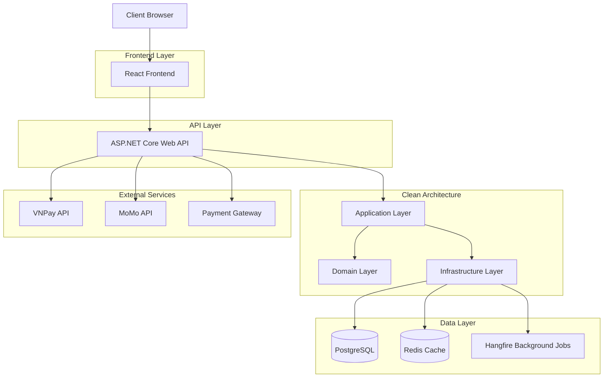

## 1. Architecture Design



## 2. Technology Description
- **Backend**: ASP.NET Core 8 Web API with Clean Architecture
- **Database**: PostgreSQL 15 with Entity Framework Core 8
- **Caching**: Redis 7+ for session and data caching
- **Background Jobs**: Hangfire for order processing and email notifications
- **Authentication**: JWT Bearer tokens with OAuth 2.0 (Google, Facebook)
- **Image Processing**: WebP conversion and lazy loading optimization
- **Containerization**: Docker with multi-stage builds
- **API Documentation**: Swagger/OpenAPI 3.0

## 3. Module Architecture & Agent Assignments

### 3.1 Database Design Module
**Agent Assignment**: Database Architecture Specialist
**Responsibilities**:
- Design entity-relationship models for products, variants, orders, users
- Create database schema with proper indexing strategies
- Implement database migration strategies
- Design audit trail and soft delete patterns

**Key Entities**:
- Products, ProductVariants, Categories, Brands
- Users, Orders, OrderItems, ShoppingCarts
- Payments, Shipments, Reviews, Inventory

### 3.2 Authentication System Module
**Agent Assignment**: Security & Identity Specialist
**Responsibilities**:
- Implement JWT authentication with refresh tokens
- Integrate OAuth providers (Google, Facebook)
- Design role-based access control (RBAC)
- Implement password policies and account lockout
- Create authentication middleware and filters

### 3.3 Product Catalog Module
**Agent Assignment**: Catalog Management Specialist
**Responsibilities**:
- Build product CRUD operations with variant management
- Implement inventory tracking and stock alerts
- Create product image upload and WebP conversion
- Design category hierarchy and navigation
- Implement product recommendations engine

### 3.4 Search System Module
**Agent Assignment**: Search & Indexing Specialist
**Responsibilities**:
- Implement full-text search with PostgreSQL
- Create search indexing strategies
- Build filtering and sorting algorithms
- Implement search suggestions and autocomplete
- Design search analytics and logging

### 3.5 Cart System Module
**Agent Assignment**: Session Management Specialist
**Responsibilities**:
- Design cart persistence strategies (Redis + Database)
- Implement cart item management operations
- Create cart abandonment tracking
- Design cart-to-order conversion logic
- Handle guest cart to user cart migration

### 3.6 Order & Checkout System Module
**Agent Assignment**: Order Processing Specialist
**Responsibilities**:
- Build order creation and validation workflows
- Implement order status management
- Create shipping calculation logic
- Design order confirmation and notification system
- Implement order history and tracking

### 3.7 Payment Integration Module
**Agent Assignment**: Payment Gateway Specialist
**Responsibilities**:
- Integrate VNPay payment gateway
- Integrate MoMo payment gateway
- Implement credit card processing
- Create payment retry and refund mechanisms
- Design secure payment tokenization

### 3.8 CMS Admin Module
**Agent Assignment**: Content Management Specialist
**Responsibilities**:
- Build admin dashboard with analytics
- Create content management for banners and blogs
- Implement SEO metadata management
- Design user management and role assignment
- Create reporting and export functionality

### 3.9 Infrastructure Setup Module
**Agent Assignment**: DevOps Infrastructure Specialist
**Responsibilities**:
- Create Docker containerization setup
- Implement CI/CD pipeline configuration
- Design logging and monitoring systems
- Setup Redis clustering and PostgreSQL replication
- Configure load balancing and SSL certificates

### 3.10 DevOps & Deployment Module
**Agent Assignment**: Deployment & Operations Specialist
**Responsibilities**:
- Create deployment scripts and automation
- Implement health checks and monitoring
- Design backup and disaster recovery
- Setup performance monitoring (APM)
- Configure auto-scaling policies

## 4. Route Definitions

| Route | Purpose | Module |
|-------|---------|---------|
| /api/auth/login | User authentication | Auth |
| /api/auth/register | User registration | Auth |
| /api/auth/oauth/google | Google OAuth integration | Auth |
| /api/products | Product CRUD operations | Catalog |
| /api/products/search | Product search functionality | Search |
| /api/products/{id}/variants | Product variant management | Catalog |
| /api/cart | Shopping cart operations | Cart |
| /api/orders | Order creation and management | Order |
| /api/orders/{id}/status | Order status updates | Order |
| /api/payments/process | Payment processing | Payment |
| /api/payments/vnpay/callback | VNPay payment callback | Payment |
| /api/payments/momo/callback | MoMo payment callback | Payment |
| /api/admin/products | Admin product management | CMS |
| /api/admin/orders | Admin order management | CMS |
| /api/admin/analytics | Admin analytics data | CMS |
| /api/blogs | Blog content management | CMS |
| /api/banners | Banner management | CMS |

## 5. Shared Contracts & DTOs

### 5.1 Authentication Contracts
```csharp
public class LoginRequest
{
    public string Email { get; set; }
    public string Password { get; set; }
    public bool RememberMe { get; set; }
}

public class AuthResponse
{
    public string AccessToken { get; set; }
    public string RefreshToken { get; set; }
    public DateTime ExpiresAt { get; set; }
    public UserDto User { get; set; }
}

public class UserDto
{
    public Guid Id { get; set; }
    public string Email { get; set; }
    public string FullName { get; set; }
    public List<string> Roles { get; set; }
}
```

### 5.2 Product Catalog Contracts
```csharp
public class ProductDto
{
    public Guid Id { get; set; }
    public string Name { get; set; }
    public string Description { get; set; }
    public decimal BasePrice { get; set; }
    public List<ProductVariantDto> Variants { get; set; }
    public List<string> Images { get; set; }
    public string Category { get; set; }
    public string Brand { get; set; }
    public int StockQuantity { get; set; }
}

public class ProductVariantDto
{
    public Guid Id { get; set; }
    public string Size { get; set; }
    public string Color { get; set; }
    public decimal PriceAdjustment { get; set; }
    public int StockQuantity { get; set; }
    public string SKU { get; set; }
}
```

### 5.3 Order Contracts
```csharp
public class CreateOrderRequest
{
    public List<CartItemDto> Items { get; set; }
    public ShippingAddressDto ShippingAddress { get; set; }
    public PaymentMethodDto PaymentMethod { get; set; }
    public string Notes { get; set; }
}

public class OrderDto
{
    public Guid Id { get; set; }
    public string OrderNumber { get; set; }
    public decimal TotalAmount { get; set; }
    public string Status { get; set; }
    public DateTime CreatedAt { get; set; }
    public List<OrderItemDto> Items { get; set; }
    public ShippingAddressDto ShippingAddress { get; set; }
}
```

### 5.4 Payment Contracts
```csharp
public class ProcessPaymentRequest
{
    public Guid OrderId { get; set; }
    public string PaymentMethod { get; set; }
    public decimal Amount { get; set; }
    public string ReturnUrl { get; set; }
}

public class PaymentResponse
{
    public string PaymentUrl { get; set; }
    public string TransactionId { get; set; }
    public string Status { get; set; }
    public string Message { get; set; }
}
```

## 6. Integration Plan

### 6.1 Module Integration Sequence
1. **Phase 1 - Foundation** (Weeks 1-2)
   - Database Design Module establishes core schema
   - Infrastructure Setup Module creates development environment
   - Authentication System Module provides security foundation

2. **Phase 2 - Core Commerce** (Weeks 3-4)
   - Product Catalog Module integrates with database
   - Search System Module connects to catalog
   - Cart System Module uses authentication for user identification

3. **Phase 3 - Transaction Processing** (Weeks 5-6)
   - Order & Checkout System Module integrates cart and catalog
   - Payment Integration Module connects to order system
   - Background jobs (Hangfire) handle payment confirmations

4. **Phase 4 - Management & Optimization** (Weeks 7-8)
   - CMS Admin Module integrates with all core modules
   - Performance optimization and caching implementation
   - Final integration testing and deployment preparation

### 6.2 Cross-Module Communication
- **Event-Driven Architecture**: Use domain events for loose coupling
- **Shared Kernel**: Common entities and value objects in Domain layer
- **API Gateway**: Single entry point for frontend applications
- **Message Queue**: Redis pub/sub for real-time notifications
- **Service Bus**: For complex workflow orchestration

### 6.3 Data Consistency Strategy
- **Unit of Work Pattern**: Ensure transaction consistency across modules
- **Eventual Consistency**: Acceptable for non-critical operations (analytics, notifications)
- **Saga Pattern**: For complex multi-step transactions (order → payment → shipping)
- **Compensation Transactions**: Rollback mechanisms for failed operations

### 6.4 Testing Integration Points
- **Contract Testing**: Verify API contracts between modules
- **Integration Testing**: End-to-end testing of module interactions
- **Performance Testing**: Load testing of critical user journeys
- **Security Testing**: Authentication and authorization testing
- **Payment Testing**: Sandbox testing for all payment gateways

### 6.5 Deployment Strategy
- **Blue-Green Deployment**: Zero-downtime deployments
- **Feature Flags**: Gradual rollout of new features
- **Database Migrations**: Version-controlled schema changes
- **Health Checks**: Comprehensive monitoring of all modules
- **Rollback Procedures**: Quick reversion capabilities

## 7. Code Quality Standards

### 7.1 Coding Standards
- Follow SOLID principles in all modules
- Implement Clean Code practices
- Use dependency injection consistently
- Apply proper error handling and logging
- Write comprehensive unit tests (80%+ coverage)

### 7.2 Documentation Requirements
- XML documentation for all public APIs
- README files for each module
- Architecture decision records (ADRs)
- API documentation with Swagger
- Deployment and configuration guides

### 7.3 Performance Requirements
- API response time < 200ms for critical endpoints
- Database query optimization with proper indexing
- Redis caching for frequently accessed data
- Image optimization and CDN integration
- Background job processing for heavy operations